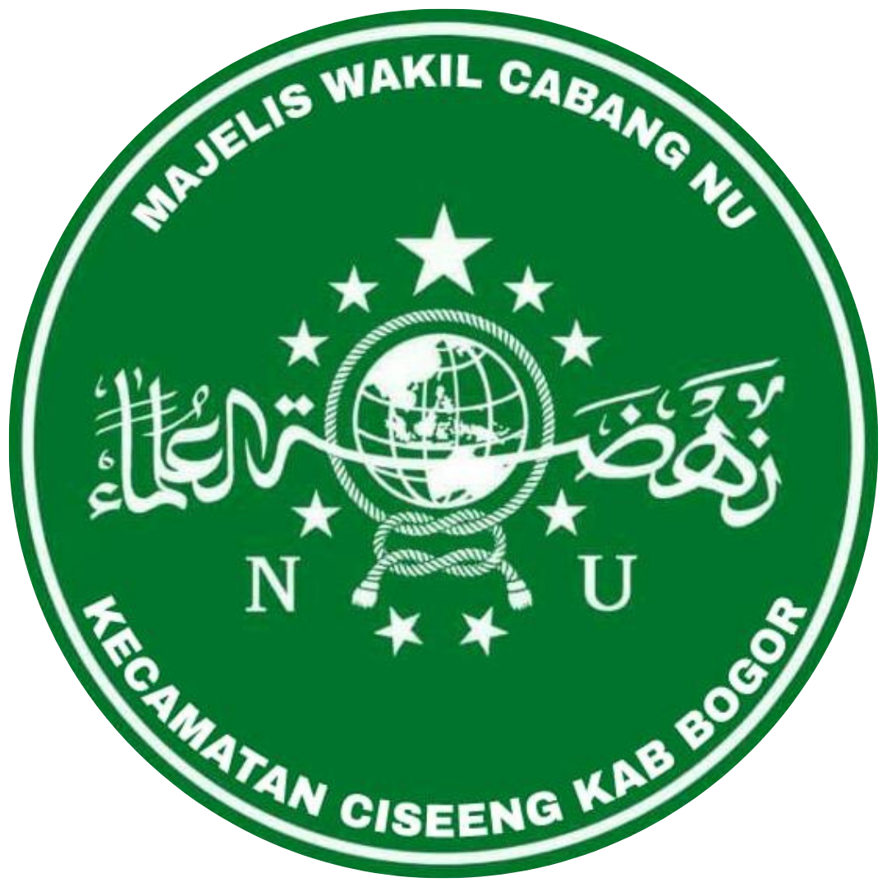

<div align="center">
  

  # Sistem Informasi MWC NU Ciseeng

  **Sistem Manajemen Konten (CMS) dan Portal Resmi untuk Majelis Wakil Cabang Nahdlatul Ulama (MWC NU) Kecamatan Ciseeng.**
  
  [](https://laravel.com)
  [](https://tailwindcss.com/)
  [](https://php.net)
</div>

---

## 📖 Tentang Proyek

Sistem Informasi MWC NU Ciseeng adalah sebuah portal digital yang dikembangkan untuk memfasilitasi kebutuhan publikasi, dokumentasi, dan manajemen administrasi MWC NU Kecamatan Ciseeng. Website ini dirancang dengan antarmuka yang modern (*smooth*, interaktif, dan *clean*) agar memudahkan warga NU maupun pengurus dalam mengakses dan mengelola informasi keorganisasian.

Sistem ini terbagi menjadi dua bagian utama:
1. **Portal Publik**: Halaman depan yang dapat diakses oleh masyarakat umum untuk membaca berita, melihat profil, struktur organisasi, dan program kerja MWC NU.
2. **CMS Admin (Dashboard)**: Halaman khusus pengurus (Super Admin & Admin) untuk mengelola seluruh konten *website*.

---

## ✨ Fitur Utama

- **Manajemen Artikel & Berita**: Sistem pembuatan artikel lengkap dengan *Rich Text Editor* (TinyMCE) dan fitur "Topik Serupa".
- **Manajemen Tupoksi**: Pengelolaan Surat Keputusan (SK), AD/ART, Program Kerja, dan Struktur Organisasi secara dinamis berdasarkan periode kepengurusan.
- **Manajemen Surat**: Pengarsipan Surat Masuk dan Surat Keluar digital.
- **Sistem Role & Multi-User**: Akses terpisah antara **Super Admin** (kendali penuh termasuk manajemen akun) dan **Admin** (fokus pada pengelolaan konten).
- **Desain Modern & Responsif**: Antarmuka *mobile-friendly* bergaya premium dengan animasi transisi yang mulus (*smooth scrolling*, efek transparan *blur*, *micro-animations*).

---

## 📸 Tampilan Antarmuka (Screenshots)

Berikut adalah beberapa tampilan dari Sistem Informasi MWC NU Ciseeng:

### 1. Halaman Utama / Portal Publik
Tampilan *landing page* yang menyambut pengunjung dengan desain *hero section* modern.


### 2. Halaman Berita & Artikel
Desain responsif untuk membaca berita/informasi terkini kegiatan MWC NU.


### 3. CMS Dashboard (Manajemen Post)
Halaman admin untuk mengelola seluruh artikel dan konten dengan antarmuka yang bersih.


---

## 💻 Teknologi yang Digunakan

* **Backend**: Laravel 11 (PHP 8.2+)
* **Frontend**: Blade Templating, Vanilla CSS, Tailwind CSS (via CDN untuk utilitas), Javascript
* **Database**: MySQL
* **Editor Konten**: TinyMCE
* **Icon & Font**: FontAwesome 6, Google Fonts (Inter)

---

## 🚀 Cara Instalasi

Ikuti langkah-langkah di bawah ini untuk menjalankan *project* ini secara lokal di komputer Anda.

### Persyaratan Sistem
- PHP >= 8.2
- Composer
- MySQL/MariaDB

### Langkah Instalasi

1. **Clone Repository**
   ```bash
   git clone https://github.com/FerryXic/sistem-informasi-mwcnu-ciseeng-laravel-12.git
   cd sistem-informasi-mwcnu-ciseeng-laravel-12
   ```

2. **Install Dependensi PHP**
   ```bash
   composer install
   ```

3. **Pengaturan Environment**
   Salin file konfigurasi bawaan dan sesuaikan dengan *database* Anda.
   ```bash
   cp .env.example .env
   ```
   Buka file `.env` dan atur konfigurasi koneksi ke *database* Anda:
   ```env
   DB_CONNECTION=mysql
   DB_HOST=127.0.0.1
   DB_PORT=3306
   DB_DATABASE=mwcnu_ciseeng
   DB_USERNAME=root
   DB_PASSWORD=
   ```

4. **Generate Application Key**
   ```bash
   php artisan key:generate
   ```

5. **Jalankan Migrasi Database**
   ```bash
   php artisan migrate
   ```

6. **Tautkan Storage untuk Gambar/Media**
   ```bash
   php artisan storage:link
   ```

7. **Jalankan Server Lokal**
   ```bash
   php artisan serve
   ```
   Buka browser dan akses aplikasi melalui `http://localhost:8000`.

---

## 👥 Hak Akses (Roles)

Aplikasi ini menggunakan sistem akses bertingkat:

* **Super Admin**: Memiliki akses ke seluruh menu CMS, termasuk hak eksklusif untuk menambahkan, mengubah, atau menghapus akun Admin/Super Admin lainnya.
* **Admin**: Dapat mengakses fitur pengelolaan konten seperti Artikel, Struktur Organisasi, SK, Surat, dan Program Kerja, namun tidak memiliki akses ke manajemen akun.
* **User (Publik)**: Hanya dapat melihat halaman depan/portal informasi, membaca artikel, dan melihat arsip.

---
<div align="center">
  <i>Dikembangkan khusus untuk MWC NU Kecamatan Ciseeng.</i>
</div>
